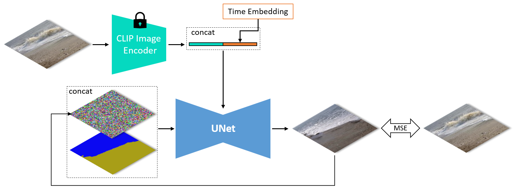
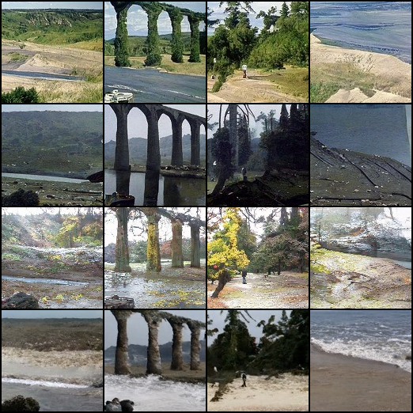

# Semantic Image Synthesis with EDM & eDiff-I for Fun

## Model Archirecture



## Results

``` text
All the testing images are not in the training set.
```

### EDM

128 x 128 images , 1000 epochs




## Reference

- [Learning Transferable Visual Models From Natural Language Supervision](https://arxiv.org/abs/2103.00020)
- [Elucidating the Design Space of Diffusion-Based Generative Models](https://arxiv.org/abs/2206.00364)
- [eDiff-I: Text-to-Image Diffusion Models with Ensemble of Expert Denoisers](https://arxiv.org/abs/2211.01324)
